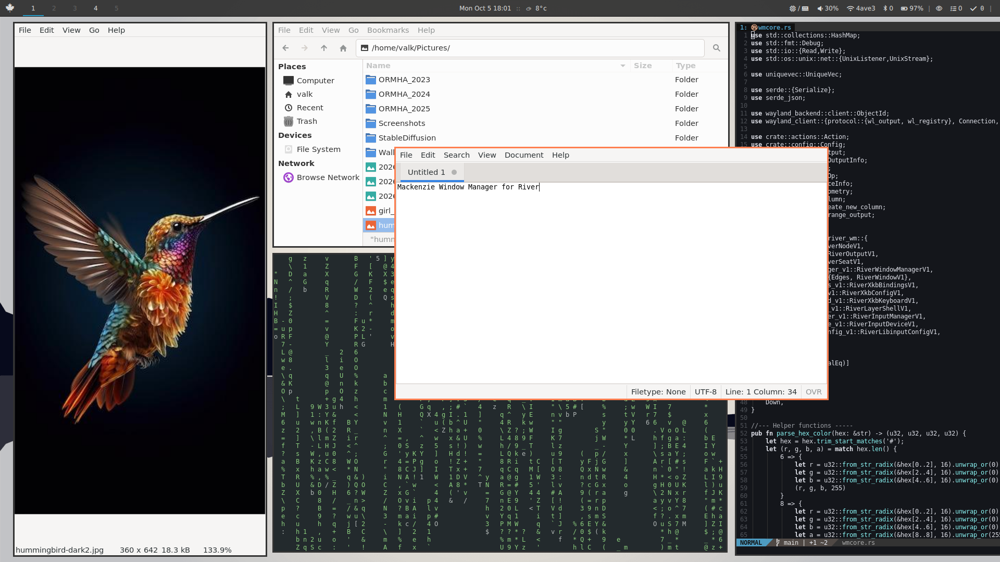

<h1 align="center"> &#x1f3de mackenzie</h1>

A simple scrolling window manager/compositor for [River](https://codeberg.org/river/river). It is written to fit my specific needs, and a way to teach myself how to code in rust. 


## Description

  - Named after the longest river in Canada, the [Mackenzie] river. 
  - Minimal scrolling layout, heavily inspired by [niri].
  - Written in [rust]
  - Built upon [tinyrwm]
  - Features:
    - No frills (menu, titlebar, icons, animations*, pixmap themes, etc...)
    - Configration file uses [toml] format
    - Supports multi-output setups
    - Basic IPC call for use with [waybar] or [quickshell]
    - Easy to read code structure so others can easily understand, reference and learn from

\* _may be added later_

[niri]: https://niri-wm.github.io/niri/index.html
[rust]: https://rust-lang.org
[tinyrwm]: https://codeberg.org/river/tinyrwm/
[toml]: https://toml.io/en/
[waybar]: https://github.com/Alexays/Waybar 
[quickshell]: https://quickshell.org/ 
[Mackenzie]: https://en.wikipedia.org/wiki/Mackenzie_River


### Screenshots

v0.1.0




## Building

  - Build dependencies
    - river >= 0.4.x
    - toml
    - libxkbcommon


```bash
cargo build --release
sudo cp target/release/mackenzie /usr/local/bin/
cp examples/mackenzie.toml ~/.config/river/
```

## Usage

Mackenzie needs to be invoked using River:

```bash
river -c mackenzie
```

or add a line to exec mackenzie in the river init file `~/.config/river/init` as follows:

```bash
#!/bin/bash

swaybg -c "#252525" &
waybar &
# ... other autostart items

exec /usr/local/bin/mackenzie
```

For use as an ipc client:

```bash
mackenzie --get     [status|version|tags]
          --watch   tags
          --action  focus_tag 1
                    focus left
                    quit 
                    ... etc
```

### Configuration

Default configuration file is read from `$HOME/.config/river/mackenzie.toml`.

It is divided into 5 sections:

  - layout - configuration of the generic WM and layout features
    ```toml
    [layout]
    n_tags = 3
    gap = 10
    scroll_edge_gap = 15
    default_column_width = 0.5
    ```
  - window - configuration of the individual window
    ```toml
    [window]
    move_resize_step = 15
    border_width = 2
    border_color_focused = "#1793D0"
    border_color_unfocused = "#333333FF"    # Specify the alpha with the last two digits
    ```
  - inputs - configuration of the inputs
    ```toml
    [inputs]
    xkb_layout = "us"
    xkb_options = "compose:ralt"
    touchpad_tap_click = true
    touchpad_natural_scroll = true
    ```
  - rules - window rules to apply 
    ```toml
    [rules]
    windowrules = [
        # template:
        # { app_id="id", title="some title", width=0.5, maximized = true, floating=true, tag=1, output="output_name" }
        {app_id="Firefox", floating = true},
    ]
    ```
  - keybinds - defines key bindings
    ```toml
    [keybinds]
    # Mod1=Alt, Mod4=Super
    Mod1-space = { action="spawn", args=["foot"] }
    Mod4-Shift-h = { action="focus", args=["left"] }
    XF86AudioMute = { action="spawn", args=["pactl", "set-sink-mute", "@DEFAULT_SINK@", "toggle"] }
    ```
    - If no configuration is provided, it defaults to two hard-coded fallback keybinds:
        - `Mod1+space` spawns foot terminal emulator
        - `Mod1+q` to quit the compositor
  - mousebinds - defines mouse bindings
    ```toml
    [mousebinds]
    Mod1-BTN_LEFT = { action="move_floating" }
    Mod1-BTN_RIGHT = { action="resize_floating" }
    ```


## Version Log

Please use the [Github Issues Tracker][ghit] to report bugs and issues.


  - 0.1 (work in progress)
    - Goal: get the base code in working order


[ghit]: https://github.com/kcirick/mackenzie/issues
